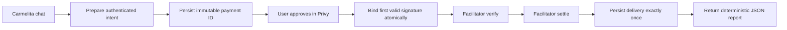
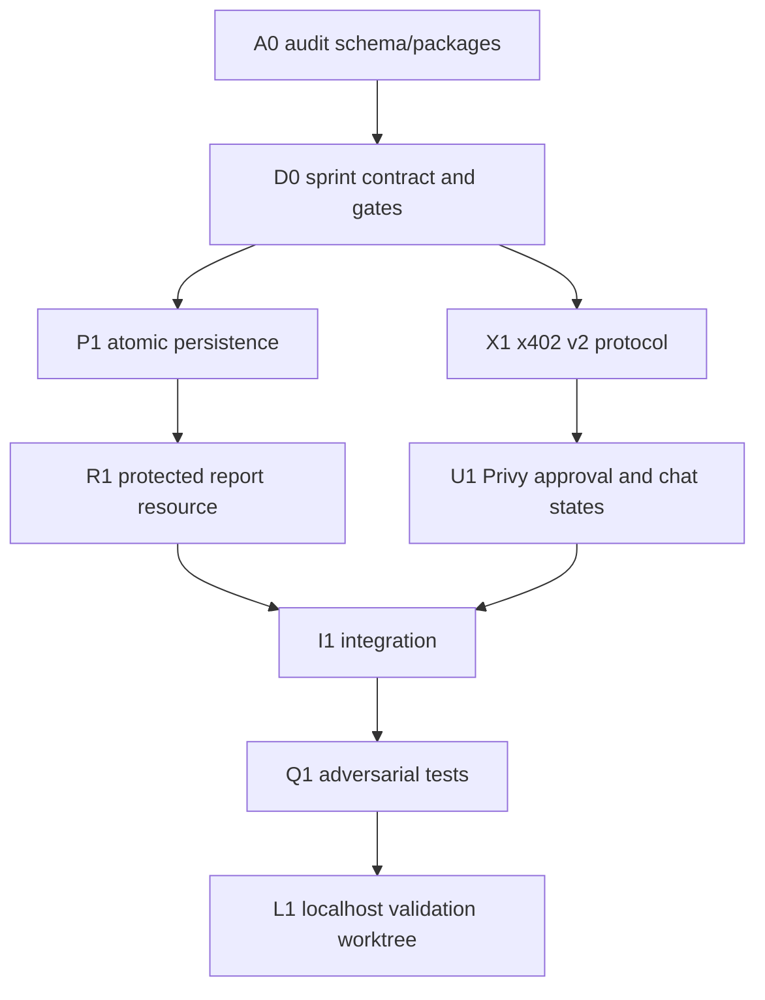

# Sprint 2: Avalanche x402 on Fuji

Status: settled for real on Fuji on 2026-07-31 and independently verified on-chain.
See "Settlement evidence" at the end of this document for the transaction and the
checks that were run against it.
Branch: `feat/multichain-wallet-foundation`  
Runtime target: localhost and Avalanche Fuji only

## Objective

Demonstrate a replay-resistant x402 v2 purchase from Carmelita's chat:

`prepare -> approve in Privy -> verify -> settle -> deliver`

The controlled resource is `POST /api/demo/avalanche-report`, priced at exactly
`0.01 USDC` (`10000` atomic units, 6 decimals) on `eip155:43113`. Delivery is
deterministic JSON with a stable delivery ID and body hash.

Settlement stays fail-closed until a human configures
`AVALANCHE_X402_PAY_TO` and explicitly approves the exact Privy authorization.
The facilitator pays gas; the user's wallet pays only the authorized USDC
amount.

## Fixed decisions

- Protocol: x402 v2, scheme `exact`.
- Network: Avalanche Fuji C-Chain (`eip155:43113`).
- Asset: Fuji USDC `0x5425890298aed601595a70AB815c96711a31Bc65`.
- Price: `0.01 USDC`, no dynamic pricing.
- Facilitator: public 0xGasless adapter; tests use deterministic mocks.
- Wallet: the authenticated user's Privy EVM wallet.
- Consent: one visible Privy approval per payment.
- Resource: local controlled report endpoint.
- Recipient: environment-only, validated, non-zero, and absent by default.
- Safety: localhost/Fuji only; no mainnet, deploy, Vercel mutation, or live funds.

## Architecture

The resource returns a standards-compatible `402 Payment Required` response and
`PAYMENT-REQUIRED` header when no payment proof is supplied. The client retries
with `PAYMENT-SIGNATURE`. Successful settlement returns `PAYMENT-RESPONSE`.

## Work DAG

## Persistence contract

Persistence is isolated from the existing Stellar x402 flow.

- Preparing the same immutable intent returns the same payment.
- A payment ID binds to the first cryptographically valid signature.
- Replaying that exact signature is idempotent.
- A different signature for the same payment is rejected.
- Only one worker can claim settlement.
- Failed or reverted settlement becomes terminal.
- Any ambiguous settle outcome (facilitator 5xx, network failure,
  timeout/abort, malformed or mismatched success payload, or a record conflict
  after settle) becomes `reconciliation_required`; it is never retried
  automatically. Only an explicit facilitator 4xx rejection (400/402/422) is
  terminal `failed`.
- One settled payment creates one delivery. Replays return the stored delivery
  byte-for-byte.

Expected lifecycle:

`prepared -> signed -> settling -> settled -> delivered`

Terminal alternatives:

`expired | failed | reverted | reconciliation_required`

## Security gates

1. **Configuration gate:** payment execution is unavailable unless
   `AVALANCHE_X402_PAY_TO` is a valid non-zero EVM address and the explicit
   localhost/Fuji live flag is enabled.
2. **Identity gate:** the Privy access token and wallet ownership must match the
   persisted user/payment.
3. **Requirement gate:** chain, token, recipient, amount, method, resource URL,
   body hash, nonce, and validity window must match the immutable intent.
4. **Signature gate:** recover the EIP-712 signer and require the persisted payer.
5. **Replay gate:** bind the first signature atomically and reject replacement.
6. **Settlement gate:** verify before settle; never deliver on failed, reverted,
   expired, malformed, or ambiguous results.
7. **Delivery gate:** unique payment and delivery IDs plus a stored body hash.
8. **Scope gate:** no mainnet, deployment, push, production variables, or funds.

## Test matrix

- Duplicate prepare requests.
- Concurrent duplicate settlement attempts.
- Same-signature retry.
- Different-signature replay.
- Expired authorization.
- Wrong chain.
- Wrong token.
- Wrong recipient.
- Wrong amount.
- Invalid signer.
- Facilitator verification failure.
- Settlement failure.
- Reverted settlement.
- Settlement timeout/ambiguous response.
- Delivery exactly once and stable body hash.
- Missing recipient/live config remains fail-closed.
- Existing Stellar x402 tests remain green.

## Definition of done

- The endpoint emits a valid x402 v2 challenge.
- `@x402/core` v2 header codecs are used and package versions remain compatible.
- No `@x402/evm` dependency is added unless its exact `2.18.0` implementation is
  required and proven compatible.
- Database transitions are atomic and independently tested.
- Chat visibly moves through `prepare`, `approve`, `settle`, and `delivered`.
- Live action cannot be triggered without recipient/configuration and human
  approval.
- Unit, integration, type, build, and focused regression checks pass.
- Runtime evidence is collected from the validation worktree only.

## Non-goals

- Selecting or funding a production receiver.
- Automatic settlement without explicit user authorization.
- Mainnet support.
- Custody of user or facilitator keys.
- Production deployment.
- Refactoring the existing Stellar x402 implementation.

## Settlement evidence (2026-07-31)

The sprint objective — `prepare -> approve in Privy -> verify -> settle -> deliver`
— completed for real. One payment of exactly `0.01 USDC` moved on Avalanche Fuji.

| Field | Value |
| --- | --- |
| Transaction | `0x3c03d58756d93da7b8a1409cf621d859c853ed54d710974229e5183cfd9b70ad` |
| Block | `57475367` |
| Timestamp | 2026-07-31T08:27:50Z |
| Chain | `43113` (Fuji) |
| Status | success |
| Asset | USDC `0x5425890298aed601595a70AB815c96711a31Bc65`, 6 decimals |
| Value | `10000` atomic units = `0.01 USDC` |
| Payer | `0x7A33b72BddF1d6D01c279b6cC9049c5E751f9d07` |
| Recipient | `0x2BAa52fA82FBFd5d103eb30181bD0Fa11a04C0d0` (the frozen `payTo`) |
| Submitted by | `0x4b9e841a…7202` — the facilitator, not the payer |
| Payer balance | 19.99 → 19.98 USDC |

### How it was verified

Directly against `https://api.avax-test.network/ext/bc/C/rpc`, not against this
application. `eth_getTransactionReceipt` returned status success on chain `43113`
with exactly **one** `Transfer` log on the expected USDC contract, carrying
`10000` units from the payer to the frozen `payTo`, and **one** EIP-3009
`AuthorizationUsed` log emitted by the token itself, burning nonce
`0x503799fd9533b66a1d03108341b92e550feffad750482ab0b21b1fd75fb16e62`.

That second log is the stronger of the two. Exactly-once is not asserted by our
database here; it is written on chain by the USDC contract, and that
authorization can never be executed again.

### Two things this run establishes that testing could not

**Gas sponsorship is measured.** The transaction was submitted by the facilitator
address, not the payer. The payer wallet held **zero AVAX** and the payment still
settled, which is exactly what EIP-3009 plus a sponsoring facilitator promises and
what no unit test could demonstrate.

**Runtime verification was added after this first payment.** The historical run
above was verified manually. The current `settlement.ts` now waits up to 30 seconds
for one Fuji confirmation, requires exactly one matching USDC
`Transfer(payer, payTo, 10000)` log, and persists the chain, transaction, payer,
recipient, asset, amount and block as `onchain_evidence` before settlement can move
to `settled` or content can be delivered. Missing, reverted or mismatched receipts
are quarantined as `reconciliation_required`.

### Still not done

- A second Privy user and application-level replay acceptance are still pending.
- The merchant endpoint now waits for a confirmed receipt, but its
  `reconciliation_required` state still needs an explicit read-only recovery path
  before the public merchant demo should be enabled.
- No balance precheck: the prepare step can still ask for a signature at zero USDC
  balance.
- The CCTP Fuji-to-Stellar bridge remains ready to test, not live-proven.
